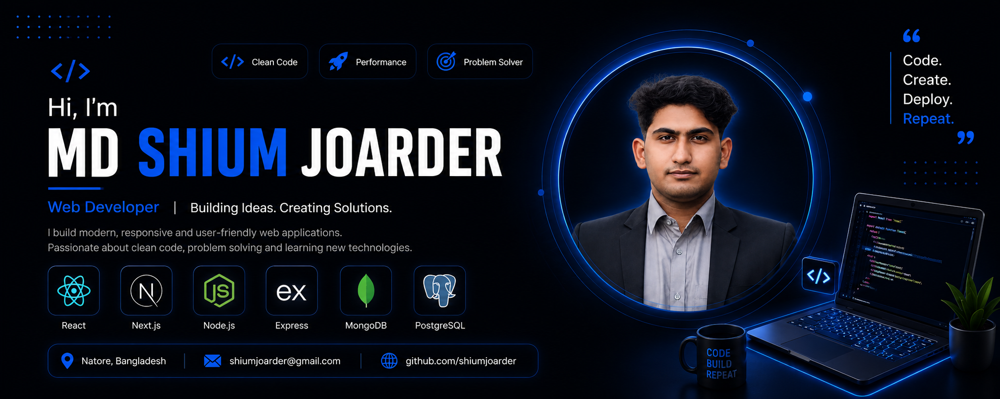

  

# Hi, I'm **MD Shium Joarder** 👋

### Full-Stack Web Developer

  Passionate about building modern, responsive, and scalable web applications.

  

 

# 👨‍💻 About Me

I'm **MD Shium Joarder**, a passionate developer focused on becoming a professional **Full-Stack Software Engineer**.

I enjoy turning ideas into functional web applications and continuously improving my skills through hands-on projects and problem solving.

* 🔭 Currently focused on **Full-Stack Web Development**
* 🌱 Learning **React, Next.js, Node.js, TypeScript and Backend Development**
* 🧩 Interested in **building real-world applications**
* 🔐 Exploring **Authentication, REST APIs and application security**
* 🐳 Learning modern development and deployment tools
* 🎯 Goal: Build scalable software and solve real-world problems

 

# 🛠️ Tech Stack

### 💻 Languages

  

### 🎨 Frontend

  

### ⚙️ Backend

  

### 🗄️ Database & ORM

  

### 🧰 Tools & Deployment

 

# 📚 Currently Learning

  

**TypeScript · React · Next.js · Node.js · REST APIs · PostgreSQL · Prisma · Docker**

 

---

# 🚀 Featured Projects

### 🔎 GitHub Finder

A web application that allows users to search GitHub profiles and explore user information, followers, following, and public repositories using the GitHub REST API.

**Tech Stack:** `HTML` `CSS` `JavaScript` `Fetch API`

  

### 🎤 DevConf 2026

A modern and responsive developer conference website featuring speakers, schedules, event details, pricing, and venue information.

**Tech Stack:** `HTML` `CSS` `Responsive Design`

  

---

# 💡 Development Philosophy

### **Learn → Build → Improve → Repeat**

 

> Building consistently, learning from mistakes, and improving with every project.

 

**Clean Code · Problem Solving · Continuous Learning · Real-World Projects**

 

---

# 🤝 Let's Connect

  I'm always open to collaboration, learning opportunities, and interesting projects.

 

  

### Let's build something meaningful together 🚀

 

---

### 💻 Learn → Build → Improve → Repeat

Thanks for visiting my profile!

